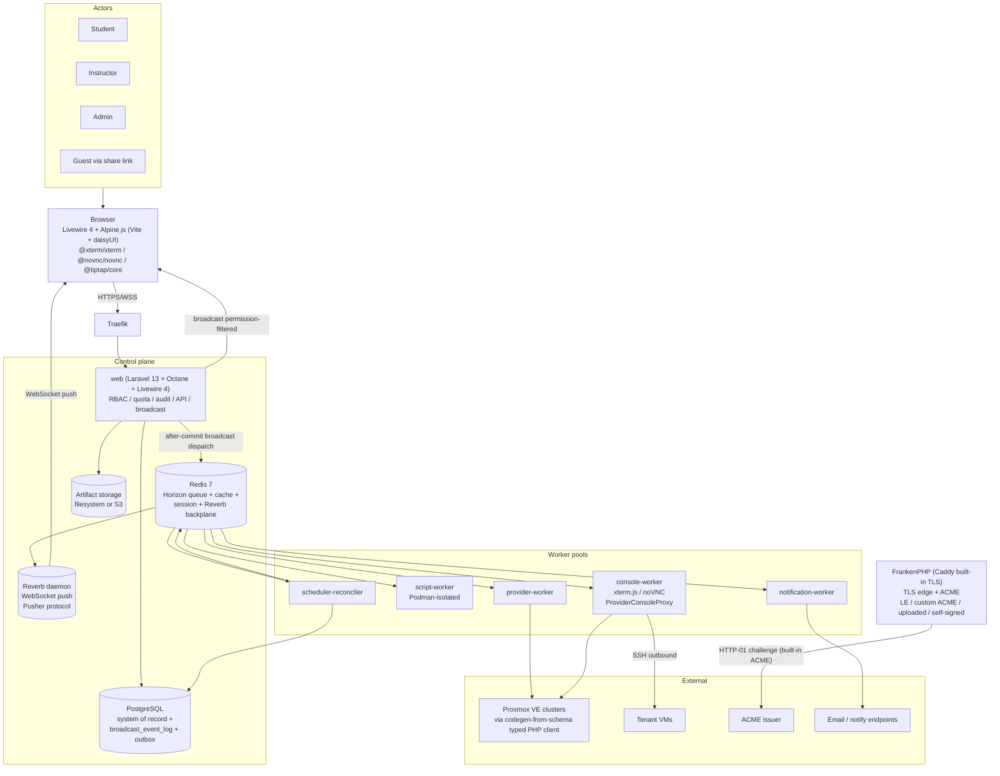
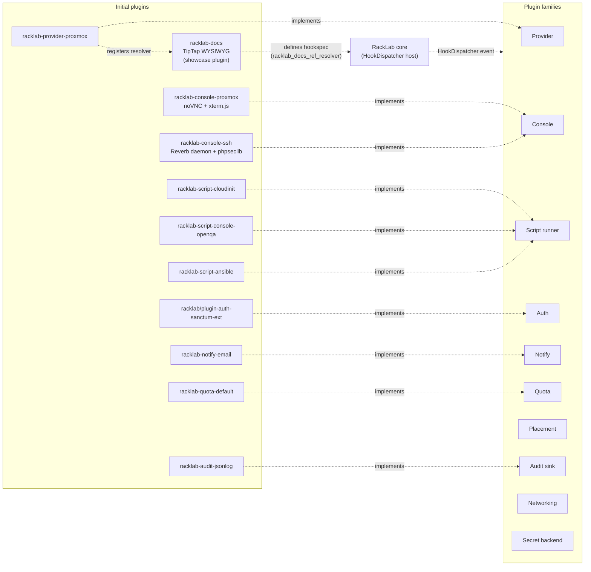
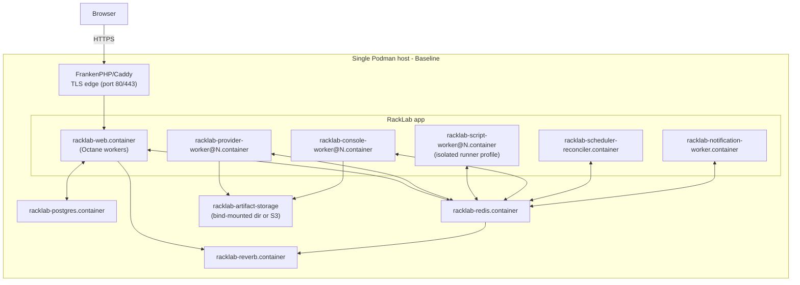
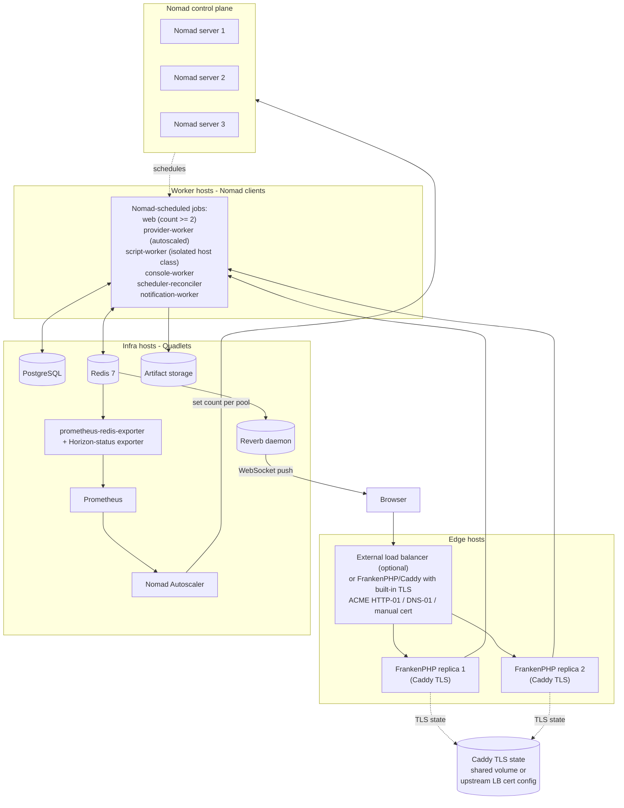
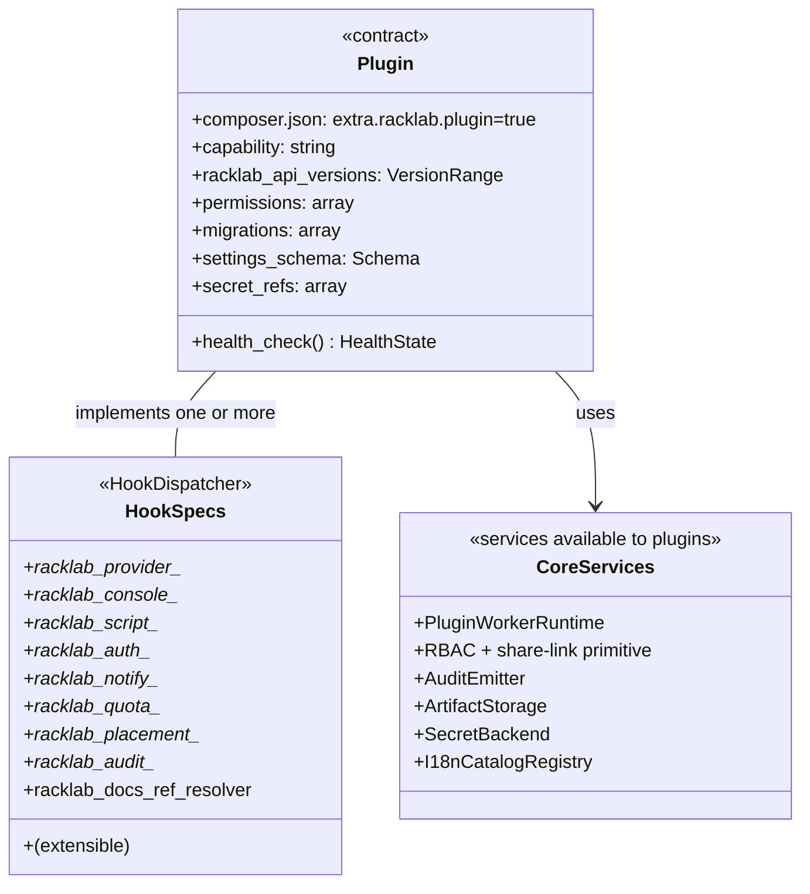

# RackLab — Architecture Diagrams

Mermaid-rendered UML-flavored diagrams covering the RackLab system as of 2026-05-24. GitHub renders mermaid natively in markdown, so these are viewable directly in the repo browser. Each diagram is scoped — together they cover the system end-to-end.

## 1. System component overview

High-level view of the major components and how data flows between them.



## 2. Plugin landscape

Plugin families and the initial plugins that exercise them. Plugins are Composer packages discovered via `PluginRegistry` (reading `"extra.racklab.plugin": true`); contracts are `HookDispatcher` events.



## 3. Deployment topology — Baseline profile

Single host, no orchestrator. Quadlets + systemd. Suitable for 1-2 user labs.



## 4. Deployment topology — Scale profile

Multi-host with Nomad scheduling RackLab containers. FrankenPHP/Caddy replicas handle TLS natively, or an upstream load balancer terminates TLS and passes plain HTTP to FrankenPHP.



## 5. Worker runtime + provider abstractions

Class diagram for the load-bearing internal abstractions. `WorkerRuntime` splits into a plugin-facing narrow interface and a core-facing full interface. The Proxmox provider hides the codegen-from-schema Proxmox client behind a typed facade.

```mermaid
classDiagram
    class PluginWorkerRuntime {
        <<interface>>
        +declare_pool(pool: WorkerPoolSpec)
        +remove_pool(pool_name)
        +list_replicas(pool_name) ReplicaStatus[]
        +runtime_capabilities() RuntimeCapabilities
    }

    class WorkerRuntime {
        <<interface>>
        +set_replicas(pool_name, count) ScaleResult
        +drain_replica(pool_name, replica_id)
        +drain_pool(pool_name)
        +host_capacity() HostCapacity[]
        +healthy() RuntimeHealth
    }

    class QuadletWorkerRuntime {
        +systemd D-Bus
        +write Quadlet files
        +systemctl + show
    }

    class NomadWorkerRuntime {
        +Nomad API client
        +render job spec from WorkerPoolSpec
        +scale count, drain via API
    }

    PluginWorkerRuntime <|-- WorkerRuntime
    WorkerRuntime <|.. QuadletWorkerRuntime
    WorkerRuntime <|.. NomadWorkerRuntime

    class ProviderPlugin {
        <<interface>>
        +clone(template, target, mode)
        +snapshot(instance, ...)
        +power(instance, action)
        +network_attach(instance, network)
        +console_grant(instance, user, ttl) ConsoleAccessGrant
        +task_poll(task_id) TaskStatus
        +capability_flags() Capabilities
    }

    class ProxmoxProviderPlugin {
        +client: ProxmoxClient
    }

    class ProxmoxClient {
        <<typed facade>>
        +clone, snapshot, power, ...
        +PHP readonly models (App\Providers\Proxmox\Models)
        +Horizon job dispatch (PollProxmoxTask)
        +task state machine
        +distributed per-node poll cap
        +structured error mapping
    }

    class GuzzleHttpTransport {
        <<transport>>
        Guzzle 7.10 HTTP client
        REST calls to Proxmox API
        raw JSON decoded to arrays
    }

    ProviderPlugin <|.. ProxmoxProviderPlugin
    ProxmoxProviderPlugin --> ProxmoxClient
    ProxmoxClient --> GuzzleHttpTransport

    class ConsoleBackend {
        <<interface>>
        +open_session(instance, user, kind) ConsoleSession
        +renderer() {vnc, terminal, ssh}
    }

    class ConsoleProxmoxBackend {
        +noVNC for KVM
        +xterm.js for LXC + serial
    }

    class ConsoleSSHBackend {
        +Reverb daemon WebSocket consumer
        +phpseclib SSH client
        +asciinema v2 recording
    }

    ConsoleBackend <|.. ConsoleProxmoxBackend
    ConsoleBackend <|.. ConsoleSSHBackend
```

## 6. Plugin contract — what a plugin actually contributes

Class-style view of what every plugin declares. The narrow `PluginWorkerRuntime` from §5 is what plugins see of the runtime.



## 7. End-to-end sequence — deploy a Stack from the catalog

The canonical flow exercising RBAC, quota, Horizon, provider-worker, Proxmox, task polling, reconciliation, and Reverb broadcast.

```mermaid
sequenceDiagram
    autonumber
    actor U as Student
    participant B as Browser
    participant T as FrankenPHP/Caddy
    participant W as web (Laravel)
    participant DB as PostgreSQL
    participant RD as Redis (Horizon)
    participant RV as Reverb
    participant PW as provider-worker
    participant PC as ProxmoxClient (facade)
    participant PX as Proxmox VE
    participant SR as scheduler-reconciler

    U->>B: Click "Deploy" on catalog Stack
    B->>T: POST /api/v1/deployments
    T->>W: forward
    W->>W: validate auth, RBAC, quota, capability
    W->>DB: BEGIN
    W->>DB: insert deployment row (status=dispatching)
    W->>DB: insert audit row
    W->>DB: insert provider_task row (status=dispatching, idempotency_key)
    W->>DB: insert broadcast_event_log row
    W->>DB: COMMIT
    W->>RD: afterCommit() job dispatch (after commit)
    W-->>B: 202 Accepted (deployment id)
    B->>RV: Echo subscribe to private-tenant.{tid}.deployment.{did}
    RV-->>B: WebSocket open

    RD->>PW: Horizon job delivery
    PW->>DB: load provider_task row
    PW->>PC: clone(template, target)
    PC->>PX: POST /api2/json/.../clone (Guzzle-backed)
    PX-->>PC: UPID
    PC->>PC: parse UPID, persist node+pid+starttime in provider_task
    PC->>DB: UPDATE provider_task (UPID, status=pending)

    loop poll with backoff + jitter + per-node distributed lock
        PC->>PX: GET task status by UPID
        PX-->>PC: running / OK / failed
    end
    PC->>DB: UPDATE provider_task (final status)
    PC-->>PW: result (TaskResult)
    PW->>DB: UPDATE deployment (status=running or failed)
    PW->>DB: insert broadcast_event_log row (in transaction)
    PW->>RD: ShouldBroadcast + ShouldDispatchAfterCommit dispatch
    RD->>RV: push to channel
    RV-->>B: broadcast event (DeploymentStateChanged)

    Note over SR,DB: parallel: reconciler polls provider_task rows that<br/>are pending/stuck, recovers orphans, never re-submits;<br/>resumes polling by UPID.
```

## 8. TLS/ACME flow — set up the domain (admin GUI)

Sequence for an admin switching from self-signed bootstrap to Let's Encrypt via the admin GUI. Highlights the hot-reload vs restart boundary.

```mermaid
sequenceDiagram
    autonumber
    actor A as Admin
    participant B as Browser
    participant W as web (Laravel + Octane)
    participant DB as PostgreSQL
    participant SD as systemd
    participant CD as FrankenPHP/Caddy
    participant LE as Let's Encrypt

    A->>B: Open System Settings → TLS
    B->>W: GET /admin/tls
    W-->>B: current config + status
    A->>B: Fill domain, select "Let's Encrypt", supply email
    A->>B: Confirm "this is a restart-required change"
    B->>W: POST /admin/tls
    W->>W: validate (DNS resolves, port 80 reachable, email valid)
    W->>DB: insert tls_config_version row (audit)
    W->>W: render new Caddyfile TLS block (ACME email, staging/production)
    W->>W: atomic write Caddyfile
    W->>SD: systemctl reload frankenphp (or restart if required)
    SD->>CD: SIGUSR1 (graceful reload) or SIGTERM + start
    CD->>CD: load new Caddyfile TLS config
    CD->>LE: HTTP-01 challenge for {domain}
    LE-->>CD: validation response
    LE-->>CD: cert + chain
    CD->>CD: store in Caddy certificate storage
    W-->>B: Livewire poll / Reverb broadcast: "Caddy reloaded, cert issued, ready"

    Note over W,CD: subsequent hot-reload changes (HSTS toggle,<br/>uploaded cert swap) do not require restart;<br/>Caddy picks them up via config reload within ~2s.
```

## How these were generated

Each diagram is a hand-written mermaid block reflecting the design decisions captured in:

- `docs/prd/` (the long-term product specification, especially §05 architecture, §13 plugin system, §15 UI/UX, §22 docs plugin, §23 SSH plugin)
- `docs/superpowers/specs/2026-05-24-proxmox-client-discipline.md` (Proxmox client facade)
- `docs/superpowers/specs/2026-05-24-podman-orchestration.md` (Baseline + Scale + `WorkerRuntime`)
- `docs/superpowers/specs/2026-05-26-laravel-redesign.md` §3 (Caddy/FrankenPHP TLS — supersedes the deleted TLS-ACME spec)

If a diagram drifts from the specs, the specs win — update the diagrams.
