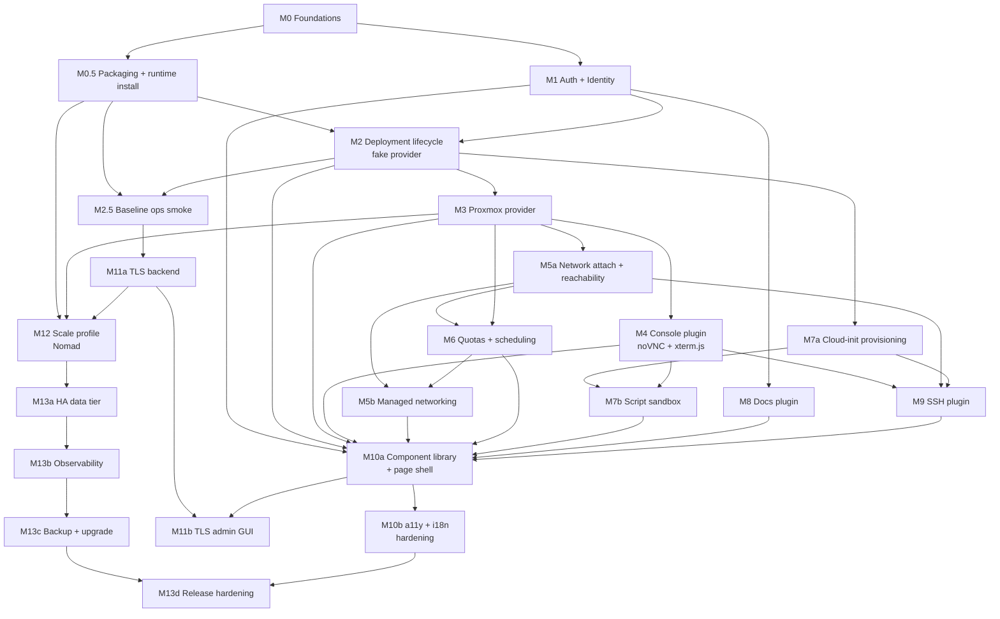

# RackLab Roadmap

The PRD (`docs/prd/`) describes the full target product. The design specs (`docs/superpowers/specs/`) lock in the load-bearing technical decisions. This roadmap turns those into an ordered sequence of milestones — each one small enough to ship and demo as a unit, each with explicit acceptance criteria and the test layers required by the TDD discipline in PRD §17.

## Milestones

The work breaks into 22 shippable milestone slices. The numbered sequence still follows M0–M13, but the high-risk milestones are split so dependencies and acceptance criteria stay executable.

| # | File | Scope | Estimate |
|---|---|---|---|
| M0 | [M00-foundations.md](M00-foundations.md) | Repo skeleton, Laravel + Composer, code CI gates, plugin framework, universal `Job` + `Artifact` models, RBAC primitives, audit subsystem, secret backend, i18n scaffolding. | 4–6 weeks |
| M0.5 | [M00.5-packaging-runtime-install.md](M00.5-packaging-runtime-install.md) | Container image build, Baseline install script, persistent plugin package cache/config, SBOM/license scanning, runtime dependency audit, artifact/secret storage bootstrap. | 2–3 weeks |
| M1 | [M01-auth-identity.md](M01-auth-identity.md) | Fortify + Socialite (OIDC/SAML via community providers), users/courses/projects/memberships, the share-link primitive, login UI, baseline branding (logo + theme variables). | 2–3 weeks |
| M2 | [M02-deployment-lifecycle.md](M02-deployment-lifecycle.md) | Catalog + catalog-versioning, deployment state machine, Reverb broadcast event stream with `Last-Event-ID` replay, Livewire dashboard, **fake provider** plugin proving the end-to-end loop. | 3–4 weeks |
| M2.5 | [M02.5-baseline-ops-smoke.md](M02.5-baseline-ops-smoke.md) | Proves the Baseline install under real operations: health checks, worker drain, backup/restore, restart, and short soak against the fake provider. | 1–2 weeks |
| M3 | [M03-proxmox-provider.md](M03-proxmox-provider.md) | `ProxmoxClient` typed facade per spec, Guzzle-based Proxmox client integration with the task-polling discipline, Proxmox provider plugin, real clone/snapshot/power. | 3–4 weeks |
| M4 | [M04-console-proxmox.md](M04-console-proxmox.md) | `racklab-console-proxmox` plugin (noVNC for KVM, xterm.js for LXC + serial), `ConsoleAccessGrant` flow, in-page console pane chrome. | 2–3 weeks |
| M5a | [M05a-networking-attach.md](M05a-networking-attach.md) | Admin-published provider networks, `NetworkOffering.reachability`, NIC attach/detach, and deployment-visible network bindings. | 2–3 weeks |
| M5b | [M05b-networking-managed.md](M05b-networking-managed.md) | Self-service networks, routers, floating IPs, security groups, drift repair/adoption, and writable Proxmox SDN/firewall realization. | 3–4 weeks |
| M6 | [M06-quotas-scheduling.md](M06-quotas-scheduling.md) | Quota policies, reservations, usage tracking, scheduling/placement, leases. | 3–4 weeks |
| M7a | [M07a-cloud-init-provisioning.md](M07a-cloud-init-provisioning.md) | Cloud-init provisioning plugin, host-key phone-home, service-key injection, script-worker scaffold, and base script data model. | 2–3 weeks |
| M7b | [M07b-script-sandbox.md](M07b-script-sandbox.md) | Ephemeral Podman container runner, Ansible Runner integration, openQA-style console automation, approval workflow, runner artifacts. | 3–4 weeks |
| M8 | [M08-docs-plugin.md](M08-docs-plugin.md) | `racklab-docs` plugin per PRD §22 (TipTap WYSIWYG, Markdown source, `racklabRef` cross-link node, `racklab_docs_ref_resolver` hookspec). | 3–4 weeks |
| M9 | [M09-ssh-plugin.md](M09-ssh-plugin.md) | `racklab-console-ssh` per PRD §23 (Reverb + server-side SSH relay, host-key capture via cloud-init, redacted asciinema recording with abort-on-failure). | 3–4 weeks |
| M10a | [M10a-ui-component-library.md](M10a-ui-component-library.md) | Livewire 4 + Tailwind/daisyUI component coverage for every PRD §15 Key Screen; Filament admin panel shell; vanilla JS islands wired into Livewire components; Laravel built-in i18n catalogs for en-US complete. | 3–4 weeks |
| M10b | [M10b-a11y-i18n-hardening.md](M10b-a11y-i18n-hardening.md) | Full WCAG 2.2 AA pass (axe-core + pa11y + manual NVDA/VoiceOver/Orca); one additional locale (es-ES) at 100% coverage; RTL verified via Arabic; high-contrast theme variant; audit-search admin UI; release-blocking a11y gates green. | 2–3 weeks |
| M11a | [M11a-tls-backend.md](M11a-tls-backend.md) | Caddy/FrankenPHP TLS Baseline integration, self-signed bootstrap certs, dynamic Caddyfile generation, TLS issuance backends, force-renew CLI, audit events. | 1–2 weeks |
| M11b | [M11b-tls-admin-gui.md](M11b-tls-admin-gui.md) | System Settings → TLS admin GUI, restart/hot-reload UX, ACME status SSE, certificate upload, HSTS controls, E2E TLS journey. | 1–2 weeks |
| M12 | [M12-scale-profile.md](M12-scale-profile.md) | Nomad + Podman driver Scale profile per the orchestration spec, Horizon queue-depth autoscaling via Prometheus + Nomad Autoscaler, `lego` cert agent for Scale ACME, multi-host runbooks. | 4–6 weeks |
| M13a | [M13a-ha-data-tier.md](M13a-ha-data-tier.md) | HA Postgres, Redis failure drills, stateful-tier failover runbooks, and data-tier operational tests. | 2–3 weeks |
| M13b | [M13b-observability.md](M13b-observability.md) | Prometheus metrics, OpenTelemetry traces, Grafana dashboards, alert rules, and observability fault-injection tests. | 1–2 weeks |
| M13c | [M13c-backup-restore-upgrade.md](M13c-backup-restore-upgrade.md) | Full backup/restore across Postgres, Redis, artifacts, plugin config, secrets, TLS state, plus Baseline/Scale upgrade drills. | 2–3 weeks |
| M13d | [M13d-release-hardening.md](M13d-release-hardening.md) | Mutation testing, 24-hour soak, capacity planning, final security review, and v1 GA release gates. | 2–3 weeks |

**Total estimated effort: ~55–80 person-weeks** of focused work. AI-assisted parallelism can shrink wall-clock time on stages with low cross-dependency, but the split milestones make the critical path explicit instead of hiding installer, TLS, networking, scripting, and operational work inside broad catch-all milestones.

## Dependency graph

The graph focuses on hard dependencies; some transitive dependencies are omitted for readability.

## How this connects to the rest of the repo

- **PRD** (`docs/prd/`) — the long-term product specification. Each milestone references the PRD sections it implements.
- **Design specs** (`docs/superpowers/specs/`) — the load-bearing technical decisions (Proxmox client, Podman orchestration, TLS/ACME). Milestones reference them where applicable.
- **Plugin PRDs** (`docs/prd/22-docs-plugin.md`, `docs/prd/23-ssh-plugin.md`) — first-party plugins with their own roadmap milestones (M8 and M9 respectively).
- **Codex review** (`docs/architecture/2026-05-24-codex-e2e-review.md`) — earlier audit whose findings were folded into the PRD and specs; this roadmap inherits the corrected state.
- **CI + linting discipline** (`.pre-commit-config.yaml`, `CONTRIBUTING.md`) — every milestone's deliverables must pass through these gates. The TDD discipline in PRD §17 is the non-negotiable test contract.

## Milestone file contract

Each `Mxx-name.md` file follows the same shape so they're skim-comparable:

1. **Header**: status, estimated effort, depends-on, unblocks.
2. **Goal**: one paragraph stating what "done" means.
3. **In scope**: PRD sections + design specs covered.
4. **Dependencies**: what must already exist.
5. **Deliverables**: the concrete artifacts (Laravel modules, plugins, models, Filament admin pages, Artisan commands, runbooks).
6. **Acceptance criteria**: testable statements; each maps to at least one test layer.
7. **Test layers**: per the TDD discipline — which modules get tiny / contract / integration / E2E coverage in this milestone.
8. **Risks / open questions**: known unknowns; resolved by spike or design review before the milestone starts.
9. **Out of scope**: what's explicitly deferred to a later milestone, with the milestone reference.

## What this roadmap is not

- **Not a calendar.** No dates. The estimate column is engineer-weeks at TDD discipline; calendar time depends on parallelism and how much of the work is AI-assisted.
- **Not immutable.** Stage scope can move between milestones if dependencies shift. The PRD wins disputes; this file follows.
- **Not a substitute for issue tracking.** When the team adopts GitHub Issues / a project board, each milestone becomes a milestone there and acceptance criteria become tracked issues.
